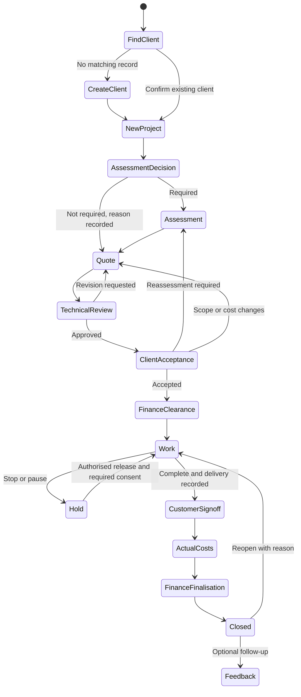
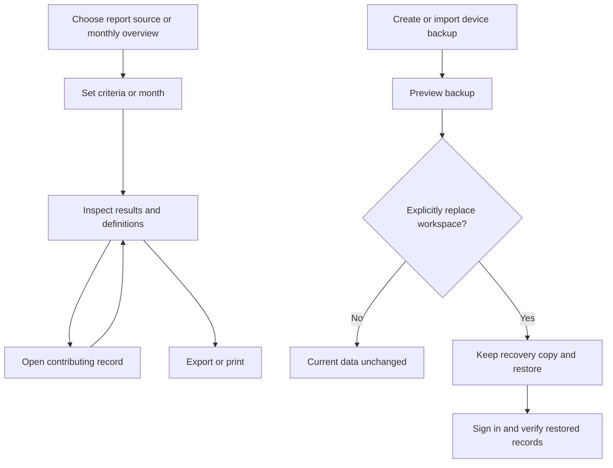

# Synthetic operator workflows

September 2026 Phase 1 operator gauntlet. These are implemented prototype journeys and provisional rules, not customer-approved production procedures. Use fictional information only. This PWA keeps records on the current device; its demo accounts do not provide production authentication or server synchronisation.

## Use-case inventory

| IDs | Operator goal | Normal path / exception |
|---|---|---|
| UC01–03 | Access the workspace | Demo sign-in; administrator creates/coordinator uses account; disabled login refused; expired-session draft recovery. First local administrator setup and forced temporary-password change belong to the database application. |
| UC04–08 | Identify and connect people | Search/filter; create client or person; review duplicates; edit roles; link new/existing OT to client; edit organisation contacts. Account permissions and person roles remain separate. |
| UC09–10 | Find a suitable technical member | Review profile, recorded capabilities/coverage and permitted qualifications; compare week/month/year calendars; save/edit/remove availability. Records do not certify suitability. |
| UC11–13 | Capture an enquiry | Choose/create client; record need; allocate known team/payer or leave unknown; review; create one project; add call notes and follow-up. |
| UC14–16 | Assess and agree the work | Assessment decision/findings; quote revision; technical review; corrections/reassessment; record quote sent and client acceptance of the reviewed revision. |
| UC17–18 | Authorise and carry out work | Record external Finance evidence; progress/hours; hold or client stop; recorded consent and authorised resume. Saving a record sends no email or payment. |
| UC19–21 | Complete or handle exceptions | Final delivery; customer sign-off; actual costs; Finance finalisation; close; optional feedback. Reopen/cancel with reason and retained history. |
| UC22–23 | Keep supporting evidence | Upload/download/remove fictional files; preview printable documents; create classified draft invoice; add references and receipt evidence. Official accounting remains separate. |
| UC24–25 | Answer reporting questions | Build/filter/select columns; save/reselect/delete report definitions; export results; select monthly overview; inspect definitions and contributing records; return to selected month/view. |
| UC26–27 | Configure and recover | Appearance; default labour rate; invoice issuer snapshot settings; create/export/import device backup; preview; explicitly restore with recovery copy. Native PostgreSQL archives are a different format. |
| UC28 | Work on a narrow screen or keyboard | Compact navigation; project section picker; labelled forms; keyboard search; calendar keyboard navigation and contained timeline scrolling. |

## UML activity model: enquiry to completion

Cancellation is a separate reasoned branch that retains evidence and requires the applicable cost/Finance finalisation before closing. Returning to an earlier approval step invalidates affected later approvals while retaining history. The diagram is a journey overview; it does not bypass actual validation.

## UML activity model: reporting and recovery

## What this cycle checks

Independent scripted browser operators exercised people/accounts/OT links, calendars, full project lifecycle, reports, invoices, files and recovery in isolated synthetic stores, with matching database-app checks. CUA browser journeys and isolated Playwright UI journeys are recorded separately in the development evidence. This is not a human customer usability study, physical-device certification or production security acceptance.

Corrections include accurate client-owned project counts in the database app, client-as-payer overview, hold-aware next action, clearer resume instructions, retained report selection, safe draft-conflict review, sign-in-and-keep-draft recovery, Adelaide receipt dates, readable restore counts and contextual save labels. A changed workflow still prevents automatic draft reconciliation; saving again remains an explicit action.

The exception pass also corrected zero-versus-unknown bike cancellations and Adelaide opening/quote dates. Zero cancelled bikes is valid explicit evidence; blank remains unknown, and delivered bike quantity still must be positive. Opening dates use recorded creation evidence when present, preserving stored historical dates otherwise.

Customer confirmation remains necessary for Finance/deposit authority, reporting formulas and GST, partial bike deliveries, historical active-member counts, revision limits, closure/feedback requirements and post-delivery rectification. Missing historical facts are shown as unknown, not reconstructed from guesses.

## Follow-up browser feedback — 25 September

Organisations now supports New organisation and full editing of name, type, description, optional category and email. The register distinguishes type from category. Existing links survive edits; a stale form requires review before resaving.

Legacy projects can resume after a client stop by recording client consent, an Administrator profile as approver and the approval date, then clearing the stop/hold flags. Guided projects retain their existing account-authorised consent workflow. The hold form explains the difference.

Receipts can be recorded after Finance finalisation until the project closes. Invoice edits remain locked after finalisation. An outstanding internal draft balance is shown with a direct Costs link; the final closure policy still needs customer confirmation. Tax-unconfirmed records remain non-issuable internal drafts and retain their original settings.

Overview payers reflect saved contributions, which are distinct from payment receipts. Audit and stale-draft comparisons use readable fields. People/client breadcrumbs return to People, contact editors use current shared person details, and allocation screens distinguish general status from dated calendar availability. People and projects are fictional; published organisation/issuer details may be real.

## Mobile regression follow-up — 25 September 2026

Shared person/intake editors preserve newer untouched contacts across stale drafts, retain deliberate clearing and keep explicit version review. New invoice composers select the sole saved contributor or require a choice. Activity shows domain stages, named people/funders and invoice numbers; guided actions no longer create unrelated administrator-review flags. Explicit existing review requests remain.

Fresh workspaces include twelve additional guided practice projects, complete fictional contact/technician data, current/next-week availability and August/September reporting examples. Existing saved device workspaces are preserved. Do not reset an existing workspace merely to activate a code update.

Final device tests: 60 passed, zero skipped. Independent mobile browser checks covered contact preservation in both directions, invoice defaults, audit values and the complete lifecycle through Finance finalisation, receipt and closure, with zero console errors. The original blank-on-first-open contact symptom was not reproduced; the stale-draft overwrite risk was corrected and verified.

## Availability date corrections - 25 September 2026

Select one day or a range and save its new status: existing overlaps are replaced only within those dates. Outside dates and notes remain intact. Choose Not recorded to clear selected dates. Indigo indicates selection separately from green/yellow/red availability. Concurrent changes show the latest calendar and retain your draft for review. The project header now emphasizes its number and uses subtle summary cards, with a full-width title on mobile. Both apps independently browser-tested; see the main repository docs/availability-range-20260925/QA.md.

## Clean-browser polish cycle - 25 September 2026

The retained main-repository scripts polish-lifecycle-qa, designer-polish-qa, polish-admin-qa and availability-range-qa exercise the PostgreSQL and device apps with isolated fictional records. See docs/polish-20260925 in TADSA for results and authorship. This cycle clarifies saved payer identities, unknown/partial technician workload, historical workflow evidence, ordinary/cancelled closure milestones, and records restore scope. Mobile status labels and recovery controls remain readable. Fresh fixture dates are fixed; publishing does not replace existing saved records. Contact prefilling was visually verified: text-only browser snapshots can omit live email/phone values even when the controls visibly contain them.
